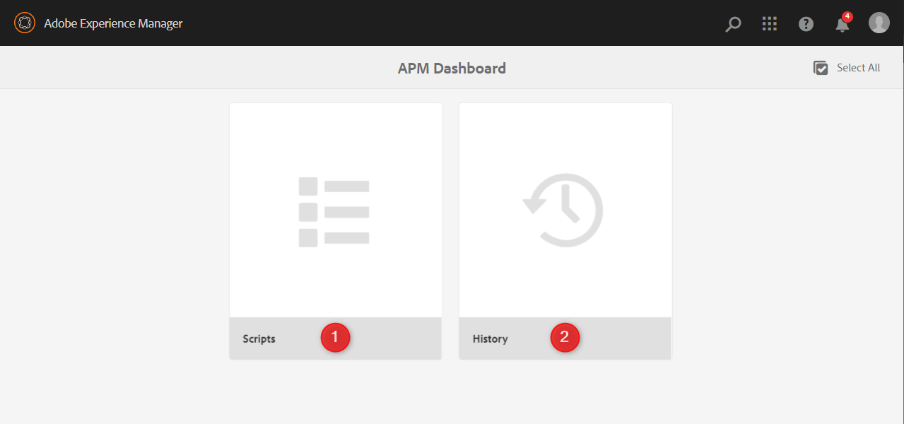
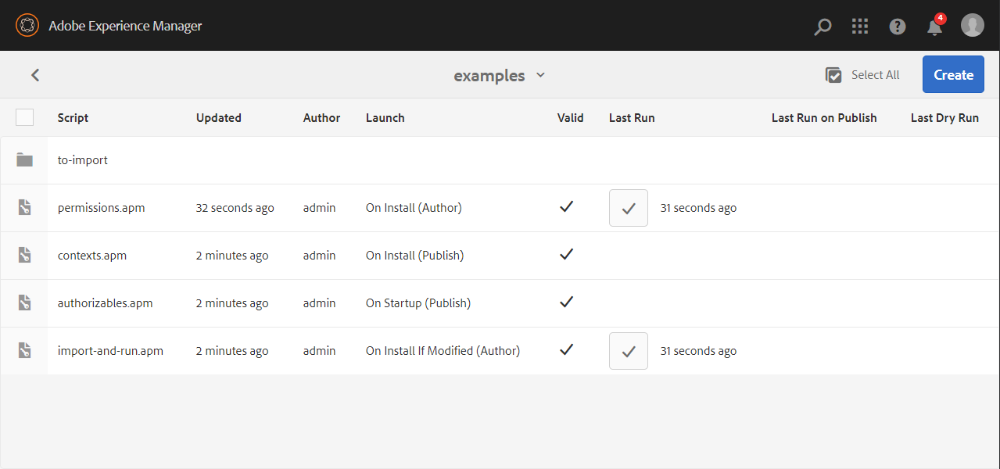
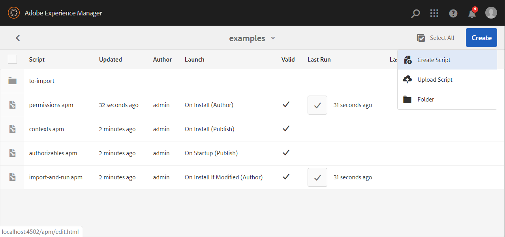
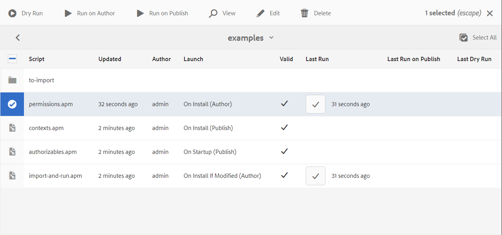
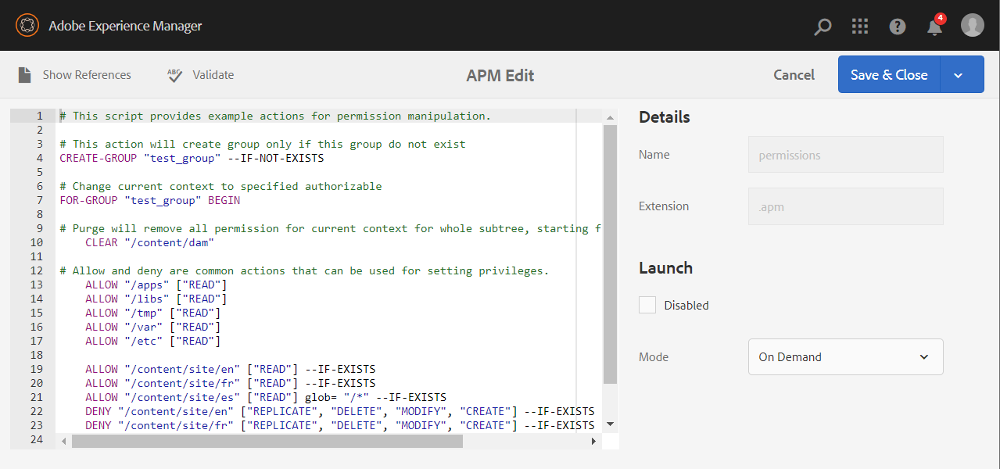
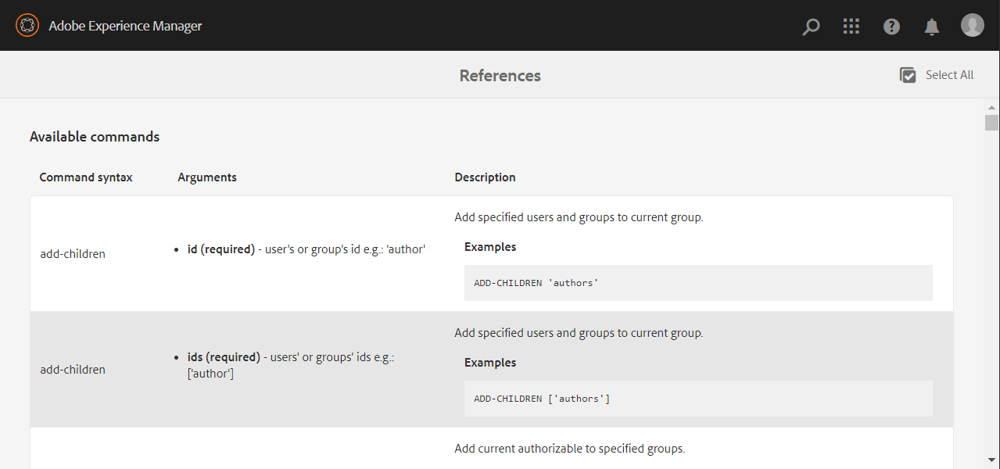
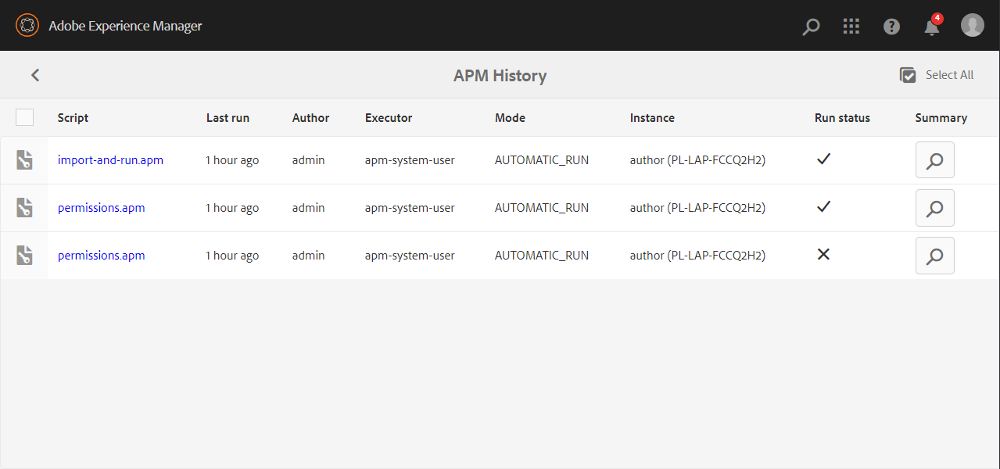
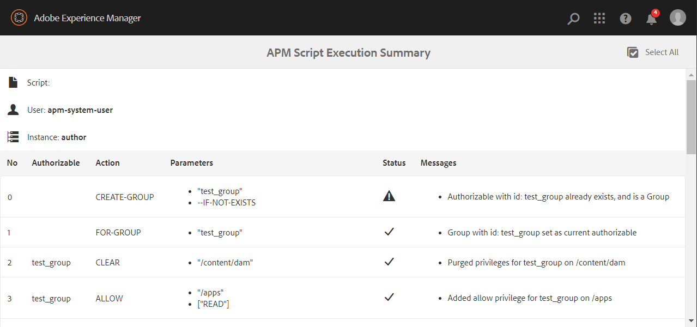

    

    

# Basic User guide
The usage of the tool should be quite intuitive, nevertheless this section describes all features available within the AEM Permission Management.

* [APM Dashboard](#apm-dashboard)
* [Scripts](#scripts)
    * [Editor](#editor)
    * [References](#references)
* [History](#history)
    * [Execution Summary](#execution-summary)

## APM Dashboard

APM Dashboard is a central hub for APM modules:
1. [Scripts](http://localhost:4502/apm/scripts.html)
2. [History](http://localhost:4502/apm/history.html)

## Scripts

The table displays scripts from the selected folder. The columns present:
* Icon of folder or script.  
* Name of the **script**.
* Date at which the script was **updated**.
* **Author** that either created or uploaded the scripts.
* **Launcher** type.
* Status of **last run**.
* Status of **last dry run**.

Button **Create** shows options, which you may perform in the current folder:
* **Create script** and open script's editor.
* **Upload script** to the current folder.
* Create new **folder**.

When you select script, action toolbar appears:
* **Dry run** button tests the script execution to find potential script issues.
* **Run** button runs the script.
* The magnifier icon opens script in **view** mode.
* The pencil icon opens script in **edit** mode.
* The bin icon **delete**s the script from the instance.

### Editor

Editor consists of 3 sections:
* Script code in the main area.
* **Details** which defines the name of script and extension. Name is editable only for new scripts.
* **Launch** which defines auto execution options.

The action toolbar defines operations:
* **Show reference** which opens a tab with list of all available actions.
* **Validate** the syntax of the script.
* **Save** the changes for the script. Ctrl+s could be used instead.

Script validation tries to parse the content of the script to make sure proper action model can be created. If a syntax issue appear, this will fail making it impossible to execute a script.

> There is a significant difference between validation and dry run. Successful validation is required in order to even dry run script. But simple validation won't give the certainty, that the script logic is right.

### References

The reference window consists of three sections:
* **Available commands** with description and examples.
* **Permissions** description.
* **Predefined definitions** list.

## History

All the script execution details are preserved, and stored within the repository. No matter whether the script has been manually or auto-executed, the GUI or API was used, the History screen keeps all the audit for the scripts executed by tool. 
The table displays the latest execution history. The columns present:
* Icon of script.  
* Name of the **script**.
* Date of **last run**.
* **Author** who starts script execution.
* **Executor** the user who executes the script.
* **Mode** of execution.
* **Instance** on which script was executed.
* The final **run status** of execution.
* Link to detailed **summary**.

### Execution Summary

Contains list of all invoked actions and detailed description about their status.