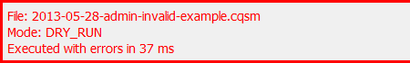
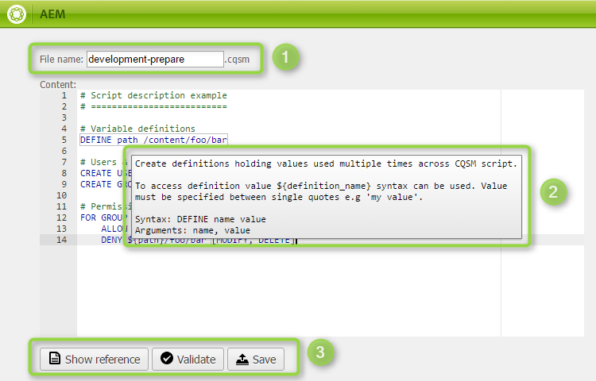
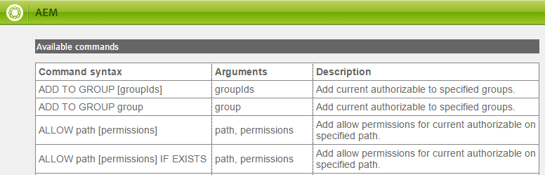
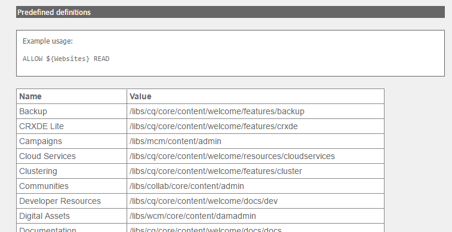

## Basic User guide
The usage of the tool should be quite intuitive, nevetheless this section describes all features available within the AEM Permission Management.

### What are the available operations on Import screen?

On the top of the page, the **Show history** (1) buton flips the screen to show the history sumary.

The actions list below (2) make it possible to:
* **upload** a new script,
* **open a console** to create a new script on th einstance,
* **remove all scripts** at once.

The table displays all scripts available to use in the AEM Permission Management tool. The columns present:
* Name of the **File**.
* **Author** that either created or uploaded the scripts.
* Date at which the script was **created**.
* Date for the **Last run on author** instance.
* Last **Dry run** execution status,
* **Actions** (3) list:
  * the magnifier icon opens a window with script content,
  * the dry run button tests the script execution to find potential script issues,
  * run on author button runs the script on the author instance,
  * run on publish button [[runs the script on publish|RunOnPublish]],
  * pencil icon opens a window with editable script,
  * bin icon removes the script from the instance.

### What are the possible script execution statuses?
Using either run or dry run button, the script is being processed and the output is written below the table. Depending on the execution mode and the processing status, the output can differ.

The table presents all the actions including the original raw action string, the outcome status and additional messages helpful while script debugging or manual validation.

Additionaly the **Export to file** (2) button downloads a text file with the json output of the script execution.

If the dry run was successful, the border around processing summary should be gray.

For the unsuccessful script run or dry run, the border around the summary will be in red.

Whever the script passes whole script execution, the border is green.

### How to create a script using the built-in console?

Once the pencil button or **Open console** buton is clicked, the console is opened.

The **File name** field (1) is editable whenever new script is being created. Once first saved, the name will be locked and the script file name change will required manual repository work. If a file name collides with any of the available scripts, the unique name with the autogenerated suffix will be provided.

The main content are is a text area where the script can be provided. If the action is recognized, hovering over it will display summary for the operation.

The actions on the bottom of the screen makes it possible to:
* Open a full **reference** guide,
* **Validate** the syntax of the script,
* **Save** the changes for the script. Ctrl+s could be used instead.

Script validation tries to parse the content of the script to make sure proper action model can be created. If a syntax issue appear, this will fail making it impossible to execute a script.

> There is a significant difference between validation and dry run. Sucessful validation is required in order to even dry run script. But simple validation won't give the certainty, that the script logic is right.

### How to use autocompletion?

The built in code editor uses the [Ace code editor](https://ace.c9.io/#nav=about). By providing an autocompletion based on keywords and regular expressions it makes the user's life easier.

### How to use the reference window?

The reference window consists of three sections:
* Actions list
* Permissions description
* Predefined definitions list

The available commands section lists all available actions. It's generated automatically based on the implementation therefore making the user sure. What's visible in the list can also be used within the script.

The permissions section briefly describes available permission modifiers and gives a quick tutorial to te most common usage of the tool.

Reference definitions section lists all available definitions ready to use in script. They shall not be overriden.
